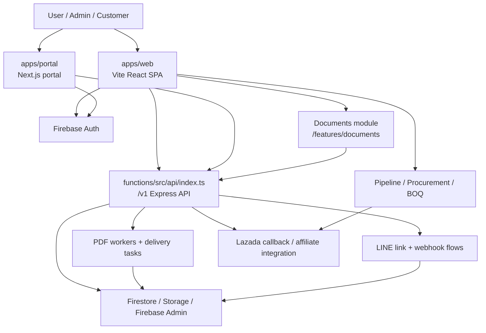
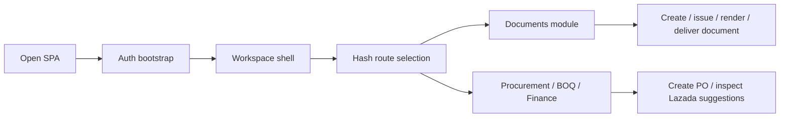
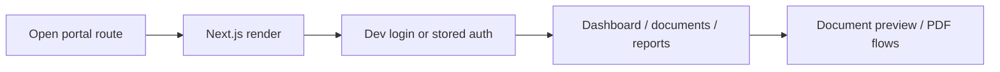
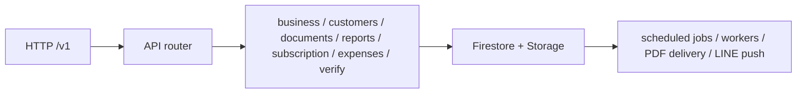

# Repo E2E Flow And Release Matrix

Date: 2026-04-03

## Repo shape

- `apps/web`
  - Vite + React SPA for EzBOQ main app
  - primary user app for workspace, BOQ, documents, procurement, finance
- `apps/portal`
  - Next.js portal/static content and dashboard surfaces
  - customer/document portal and SEO/public content
- `functions`
  - Firebase Functions + Express API + scheduled jobs + workers
  - LINE webhook, documents API, reports, subscription, verification, PDF delivery, Lazada callback
- `shared`
  - shared UI and type/code used across apps
- `tests/e2e`
  - root Playwright smoke/regression for `apps/web`

## System flow

## Primary E2E paths

### 1. EzBOQ web app

### 2. Portal path

### 3. Backend service path

## Current automated coverage

| Area | Harness | Current coverage |
| --- | --- | --- |
| `apps/web` | Root Playwright | login shell, public info routes, documents route, document create/issue/render/deliver, mobile footer taps |
| `apps/web` | Vitest | workspace unit tests from package script |
| `apps/portal` | Portal Playwright | quotation to PDF, bill to PDF, receipt to PDF, confirm document, responsive coverage |
| `functions` | Jest | services/core regression tests under `functions/src/__tests__` |
| `shared` | static checks | lint + typecheck only |

### Portal harness notes

- `apps/portal` E2E no longer depends on `next dev`
- Playwright builds the static export and serves `apps/portal/out` through `scripts/serve-export.mjs`
- auth bypass for browser automation is runtime-only on `localhost` via `ezdoc-e2e-dev-bypass`
- this keeps the bypass out of production while making local browser coverage deterministic

## Release verification matrix

Run these before shipping:

1. `npm run lint --workspace=apps/web`
2. `npm run typecheck --workspace=apps/web`
3. `npm run build:web`
4. `npx playwright test -c playwright.config.ts`
5. `npm run lint --workspace=apps/portal`
6. `npm run typecheck --workspace=apps/portal`
7. `npm run build:portal`
8. `npm run test:e2e --workspace=apps/portal`
9. `npm run lint --workspace=functions`
10. `npm run typecheck --workspace=functions`
11. `npm run build:functions`
12. `npm run test --workspace=functions`
13. `npm run lint --workspace=shared`
14. `npm run typecheck --workspace=shared`
15. `npm run release:verify:full`

## Release notes from this pass

- Fixed a real `apps/web` lint blocker in Lazada query sanitization
- Mounted category-level Lazada suggestions into procurement so the component is no longer dead code
- Root web Playwright smoke suite is green after the hotfix
- Portal build/typecheck is green locally
- Portal E2E harness now runs against the exported build artifact and passes `24/24`
- Root aggregate verification now passes through all repo checks except external deploy providers

## Remaining gaps

- Repo-wide aggregate verification exists, but it still emits raw CLI output instead of a single consolidated artifact/report
- `shared` still has no dedicated tests
- Performance debt remains in large frontend bundles (`firebase`, `jspdf`, `html2canvas`, main CSS)
- Staging deploy currently depends on expired Firebase CLI auth on this machine
- Production deploy to Vercel still fails after upload with an upstream `Unexpected error` / `deployment not ready` state even when `.vercel/output` is valid locally
