# EzBOQ RFQ Marketplace MVP

## Goal

ทำให้ผู้ใช้ EzBOQ แปลง BOQ เป็น `Purchase List` แล้วส่ง `RFQ (Request for Quotation)` ไปยังร้านวัสดุในรัศมีประมาณ `10–30 กม.` จากไซต์งาน เพื่อรับราคากลับพร้อม `ค่าส่ง` และ `ETA` โดยเริ่มจาก workflow แบบ `no-API` ผ่าน `LINE OA`, `Google Form`, และ `แอดมินโทรกลับ`

ระบบนี้ต้องเริ่มใช้งานจริงในไทยได้ แม้ร้านวัสดุ local ยังไม่มี ERP หรือ API

## MVP Scope

### Phase 1: Catalog + Purchase List

- Material master และสินค้า catalog สำหรับวัสดุก่อสร้างหมวดหลัก
- Vendor master พร้อมพื้นที่จัดส่งและช่องทางตอบราคา
- Match BOQ → Product Catalog
- สร้าง Purchase List และ draft PO จาก BOQ

### Phase 2: RFQ Board

- ยิง RFQ ไปยัง vendor ที่อยู่ในรัศมี 10–30 กม.
- รับราคากลับแบบ no-API
- แสดง comparison ตาม `material subtotal + shipping + ETA`

### Phase 3: PO + Delivery Coordination

- อนุมัติ vendor ที่ชนะ
- แปลง quote เป็น PO
- ติดตามรอบส่งของเข้าไซต์

## User Flow

```mermaid
flowchart LR
  A["BOQ เสร็จ"] --> B["Normalize เป็น Purchase List"]
  B --> C["Match กับ Material Master / Catalog"]
  C --> D["เลือก Vendor ในรัศมี 10–30 กม."]
  D --> E["ส่ง RFQ ผ่าน LINE / Form / Admin Call"]
  E --> F["Vendor ส่งราคา + ค่าส่ง + ETA"]
  F --> G["เปรียบเทียบ Landed Cost"]
  G --> H["Owner / PM อนุมัติ"]
  H --> I["สร้าง PO"]
  I --> J["ส่งของเข้าไซต์ / ติดตาม ETA"]
```

## Database Schema

เสนอ collections หลักใน Firestore:

### `materialMasters/{materialId}`

- `sku`: canonical SKU เช่น `CEM-SCG-PORTLAND-T1-50KG`
- `name`: ชื่อ canonical
- `category`: `cement | steel | brick | tile | paint | plumbing | electrical | hardware`
- `subcategory`
- `brand`
- `spec`
- `unit`
- `packSize`
- `qualityTier`: `economy | standard | premium`
- `searchAliases`: array ของ alias ภาษาไทย/อังกฤษ/ชื่อเรียกหน้าร้าน
- `keywords`: array สำหรับ search/matching
- `active`
- `createdAt`
- `updatedAt`

### `vendors/{vendorId}`

- `name`
- `branchName`
- `contactName`
- `phone`
- `lineId`
- `address`
- `district`
- `province`
- `lat`
- `lng`
- `deliveryRadiusKm`
- `maxDeliveryRadiusKm`
- `coverageAreas`
- `responseChannels`: `line_oa | google_form | admin_call`
- `supportsCredit`
- `supportsVatInvoice`
- `supportsScheduledDelivery`
- `serviceLevel`: `same_day | next_day | standard`
- `status`: `prospect | onboarding | active | paused`
- `createdAt`
- `updatedAt`

### `vendorProducts/{vendorProductId}`

- `vendorId`
- `materialId`
- `vendorSku`
- `vendorProductName`
- `brand`
- `spec`
- `unit`
- `price`
- `lastQuotedAt`
- `leadTimeDays`
- `stockStatus`
- `minOrderQty`
- `notes`

### `rfqs/{rfqId}`

- `workspaceId`
- `projectId`
- `projectName`
- `siteAddress`
- `siteLat`
- `siteLng`
- `searchRadiusKm`
- `status`: `draft | sent | collecting | comparing | approved | closed`
- `requestedBy`
- `requestedAt`
- `quoteDueAt`
- `lineCount`
- `estimatedSubtotal`
- `selectedQuoteId`
- `notes`

### `rfqLines/{lineId}` (subcollection under RFQ or embedded)

- `materialId`
- `boqNo`
- `description`
- `normalizedName`
- `quantity`
- `unit`
- `requiredByDate`
- `matchConfidence`
- `status`: `matched | review | unmatched`

### `vendorQuotes/{quoteId}`

- `rfqId`
- `vendorId`
- `channel`
- `status`: `pending | received | verified | rejected | selected`
- `materialSubtotal`
- `shippingFee`
- `etaDays`
- `landedCost`
- `paymentTerms`
- `vatIncluded`
- `responseSource`: `line_message | form_submit | admin_entry`
- `responseBy`
- `respondedAt`
- `verifiedAt`

### `vendorQuoteLines/{quoteLineId}`

- `quoteId`
- `rfqLineId`
- `materialId`
- `quotedUnitPrice`
- `quotedQty`
- `availableQty`
- `unit`
- `etaDays`
- `substitutionMaterialId`
- `notes`

### `purchaseOrders/{poId}`

- `workspaceId`
- `projectId`
- `rfqId`
- `quoteId`
- `vendorId`
- `status`: `draft | approved | sent | acknowledged | delivering | completed | cancelled`
- `poNumber`
- `materialSubtotal`
- `shippingFee`
- `vatAmount`
- `grandTotal`
- `deliveryEtaDate`
- `deliveryWindow`
- `siteContact`
- `sitePhone`
- `deliveryInstructions`
- `createdAt`
- `approvedAt`

## Material Master 200 SKU Design

### Recommended first 200 SKU allocation

- Cement / Mortar / Adhesives: `35`
- Steel / Rebar / Structural: `25`
- Brick / Block / Masonry: `20`
- Tile / Flooring / Surface: `35`
- Paint / Waterproof / Chemical: `30`
- Plumbing / Drainage: `20`
- Electrical / Wire / Conduit: `20`
- Hardware / Fastener / Accessory: `15`

รวม `200 SKU`

### Canonical field rule

ทุก SKU ควรมี:

- `canonicalName`
- `brand`
- `spec`
- `unit`
- `packSize`
- `grade`
- `aliasKeywords`
- `preferredUseCases`

### Example naming convention

- `CEM-SCG-PORTLAND-T1-50KG`
- `TIL-COTTO-PORCELAIN-60X60-IVORY`
- `PNT-TOA-SUPERSHIELD-BASEA-9L`
- `PLB-SCG-PVC-PIPE-1_5IN-8_5`
- `ELE-YAZAKI-THW-2_5SQMM-100M`

## SKU Normalization Strategy

ร้านไทยเรียกชื่อสินค้าไม่เหมือนกัน เช่น:

- `ปูนปอร์ตแลนด์`
- `ปูนตราเสือปอร์ตแลนด์`
- `SCG Portland Type 1`

ทั้งหมดควรถูก normalize เข้า key เดียว

### Matching layers

1. `Brand dictionary`
   แยก brand เช่น `SCG`, `TOA`, `COTTO`, `YAZAKI`
2. `Category dictionary`
   ดูคำบอกกลุ่ม เช่น ปูน, กระเบื้อง, สี, ท่อ, สายไฟ
3. `Spec parser`
   จับขนาด/รุ่น เช่น `60x60`, `2.5 sqmm`, `1/2 นิ้ว`, `50kg`
4. `Alias map`
   เก็บชื่อเรียกซ้ำของร้านต่าง ๆ
5. `Confidence scoring`
   ถ้า score ต่ำให้ขึ้นสถานะ `review`

### Output

- `normalizedName`
- `normalizedBrand`
- `normalizedSpec`
- `confidence`
- `reviewReason`

## Vendor Onboarding Sheet

ขั้นต่ำควรเก็บ:

- ชื่อร้าน / สาขา
- จังหวัด / เขต / พื้นที่จัดส่ง
- จุดเด่นหมวดสินค้า
- มี VAT / ไม่มี VAT
- เครดิตเทอม
- ช่องทางตอบราคา
- เบอร์ติดต่อฝ่ายขายโครงการ
- LINE OA / LINE ID
- เวลาตอบกลับเฉลี่ย
- ส่งด่วนได้หรือไม่
- รถ 4 ล้อ / 6 ล้อ / crane / ยกลงเองหรือไม่
- เวลาเปิดทำการ
- หมายเหตุความเสี่ยง เช่น ของหมดบ่อย / รับเฉพาะ order ใหญ่

## Vendor Acquisition Priority

ควรดึงเข้าระบบตามลำดับนี้:

1. ร้านที่ขาย `ปูน / กาว / กระเบื้อง / สี`
   เพราะมีความถี่สูงใน BOQ และตัดสินใจซื้อเร็ว
2. ร้านที่ส่งในรัศมีใกล้ไซต์จริง
   เพราะค่าส่งและ ETA กระทบ landed cost มาก
3. ร้านที่ตอบราคาผ่าน LINE ได้เร็ว
4. ร้านที่ออก VAT invoice ได้
5. ร้านที่รับ order โครงการ ไม่ใช่แค่ลูกค้าปลีก

## Vendor Pitch

ข้อความชวนร้านเข้าระบบแบบสั้น:

> EzBOQ มีลูกค้าที่ทำ BOQ เสร็จแล้วและพร้อมซื้อวัสดุจริง เราช่วยส่งรายการวัสดุที่ชัดเจนให้ร้านคุณ พร้อมจำนวน หน่วย และไซต์งาน เพื่อให้ร้านเสนอราคาได้เร็วขึ้น โดยเริ่มจาก LINE / ฟอร์มก่อน ไม่ต้องมีระบบ API

## MVP Page Design

หน้า MVP ควรมี 4 blocks:

1. `Project Context`
   ชื่อโครงการ, purchase list summary, estimated material spend
2. `Catalog + Match`
   รายการสินค้าที่ match กับ BOQ และรายการที่ต้องรีวิว
3. `Quote Board`
   เทียบ vendor ตาม landed cost, shipping, ETA
4. `RFQ / Checkout`
   ช่องทางยิง RFQ, note ถึงร้าน, site instruction, approve PO

## Landed Cost Logic

สูตรเริ่มต้น:

`landedCost = materialSubtotal + shippingFee`

คะแนนเปรียบเทียบ:

- `landedCostRank`
- `etaRank`
- `coverageFit`
- `matchCoverage`
- `vendorResponseReliability`

### Decision rule (MVP)

- Default sort: landed cost ต่ำสุด
- ถ้า ETA ต่างเกิน 2 วัน ให้โชว์ badge เตือน
- ถ้า match coverage ต่ำกว่า 70% ให้ไม่แนะนำ auto-select

## Quote Intake Channels

### LINE OA

- ส่งข้อความ RFQ พร้อมสรุปรายการ
- ร้านตอบกลับด้วยราคา + ค่าส่ง + ETA
- แอดมิน verify และกรอกเข้า quote board

### Google Form

- สร้างฟอร์มตาม RFQ
- ร้านกรอกราคาแต่ละรายการ
- ฝั่งระบบ ingest เข้า quote queue

### Admin Call

- แอดมินโทรร้าน
- กรอกราคากลับหลังบ้าน
- แนบ note ความน่าเชื่อถือและข้อจำกัดการส่ง

## Revenue Model Recommendation

### Start first: `success fee`

เหตุผล:

- ร้านเข้าใจง่ายสุด
- ลด friction ตอน onboarding
- ไม่ต้องตั้งราคา package ตั้งแต่แรก
- สอดคล้องกับงานจริง: มี order จึงค่อยเก็บ

### Phase later

- `subscription` สำหรับ vendor premium ที่อยากได้ lead priority
- `lead fee` ใช้เฉพาะกรณี high-intent lead ที่ไม่การันตีปิด order
- `margin resale` ค่อยทำเมื่อควบคุม supply chain ได้จริง

## Recommended MVP KPIs

- RFQ sent per week
- Quote response rate
- Median response time
- Matched coverage %
- Win rate by vendor
- Average shipping fee by distance band
- Approved PO GMV

## What to build next in code

1. Material master + vendor master types
2. Purchase list transformer จาก BOQ
3. RFQ board UI
4. Quote intake admin screen
5. PO generation from selected quote
