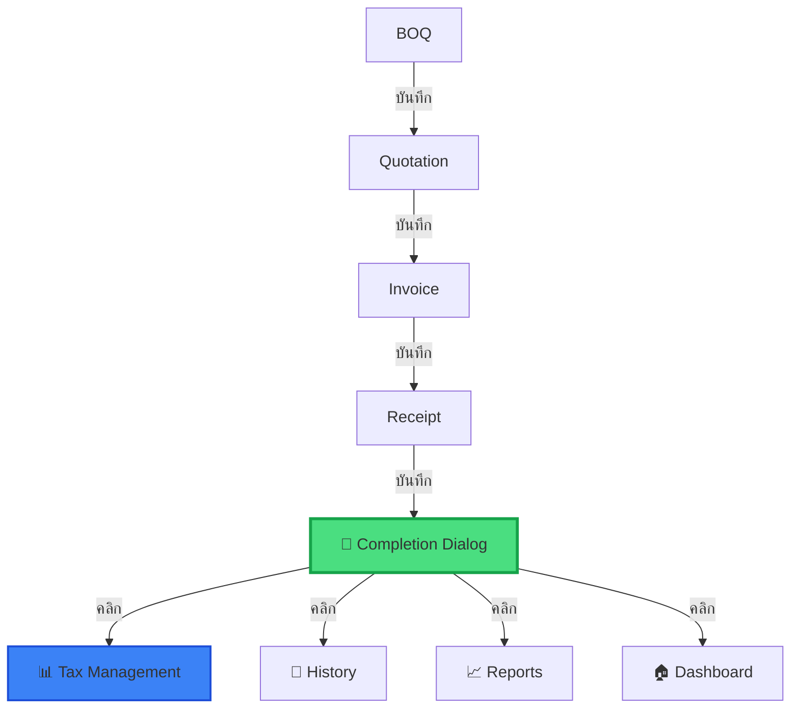

# 🎯 Workflow Navigation Upgrade - Completion Summary Dialog

## 📋 **สรุปการแก้ไข**

ปรับปรุงระบบ navigation หลังบันทึกเอกสารตาม workflow ที่ต้องการ พร้อมเพิ่ม **Completion Summary Dialog** สำหรับ UX ที่ดีขึ้น

---

## ✅ **New Navigation Flow**

### **1. BOQ**
- ✅ บันทึกแล้วไป → **Quotation** (ขั้นตอนถัดไป)
- ไม่เปลี่ยนแปลง (ยังคงเดิม)

### **2. Quotation (ใบเสนอราคา)**
- ✅ บันทึกแล้วไป → **Invoice** (ขั้นตอนถัดไป)
- ผู้ใช้สามารถกดปุ่มอื่นเพื่อไปหน้า History, Reports, หรือ Dashboard ได้

### **3. Invoice (ใบวางบิล)**
- ✅ บันทึกแล้วไป → **Receipt** (ขั้นตอนถัดไป)
- ผู้ใช้สามารถกดปุ่มอื่นเพื่อไปหน้า History, Reports, หรือ Dashboard ได้

### **4. Receipt (ใบเสร็จ/ใบกำกับภาษี)** 🎉
- ✅ **แสดง Completion Summary Dialog** ทันทีหลังบันทึกสำเร็จ
- ผู้ใช้เลือกปลายทางเอง:
  - 📊 **จัดการภาษี** (แนะนำสุด) → Tax Management Page
  - 📄 **ดูประวัติเอกสาร** → History Page
  - 📈 **ดูรายงาน** → Reports Page
  - 🏠 **กลับหน้าหลัก** → Dashboard

---

## 🆕 **New Component**

### **CompletionSummaryDialog.tsx**

```tsx
interface CompletionSummaryDialogProps {
  open: boolean;
  onOpenChange: (open: boolean) => void;
  documentType: "quotation" | "invoice" | "receipt";
  documentNumber: string;
  onNavigate: (destination: "history" | "tax" | "reports" | "dashboard") => void;
}
```

**Features:**
- ✅ Animation ด้วย Framer Motion (spring effect)
- ✅ แสดงหมายเลขเอกสารที่บันทึกสำเร็จ
- ✅ ปุ่มนำทางแบบ dynamic ตามประเภทเอกสาร
- ✅ Primary action (Tax Management) สำหรับ Receipt
- ✅ UX-friendly design ตาม Material Design principles

---

## 🔧 **Modified Files**

### **1. AppWorkflow.tsx**

**เพิ่ม:**
```typescript
// Completion dialog state
const [showCompletionDialog, setShowCompletionDialog] = useState(false);
const [completedDocumentType, setCompletedDocumentType] = useState<"quotation" | "invoice" | "receipt">("quotation");
const [completedDocumentNumber, setCompletedDocumentNumber] = useState("");

// Props
interface AppWorkflowProps {
  user: User | null;
  editingDocument?: Document | null;
  onNavigate?: (view: string) => void; // ✅ NEW!
}
```

**แก้ไข `saveDocument()`:**
```typescript
const saveDocument = async (type: 'boq' | 'quotation' | 'invoice' | 'receipt', showDialog = false) => {
  // ... existing code ...
  
  if (showDialog) {
    setCompletedDocumentType(type);
    setCompletedDocumentNumber(result.document?.documentNumber || '');
    setShowCompletionDialog(true);
  }
  
  return true;
}
```

**Receipt Page:**
```typescript
onSave={async () => await saveDocument('receipt', true)} // ✅ showDialog = true
```

**Dialog Component:**
```tsx
<CompletionSummaryDialog
  open={showCompletionDialog}
  onOpenChange={setShowCompletionDialog}
  documentType={completedDocumentType}
  documentNumber={completedDocumentNumber}
  onNavigate={(destination) => {
    if (onNavigate) {
      const viewMap = {
        history: 'history',
        tax: 'tax-management',
        reports: 'reports',
        dashboard: 'dashboard'
      };
      onNavigate(viewMap[destination]);
    }
  }}
/>
```

### **2. AppWithAuth.tsx**

**แก้ไข:**
```tsx
<AppWorkflow 
  user={user} 
  editingDocument={editingDocument}
  onNavigate={(newView) => {
    setView(newView as View);
    setEditingDocument(null);
  }}
/>
```

---

## 📸 **Dialog Screenshot Preview**

```
╔════════════════════════════════════════╗
║          🎉 บันทึกสำเร็จ! 🎉          ║
╠════════════════════════════════════════╣
║   บันทึกใบเสร็จ/ใบกำกับภาษีเรียบร้อย   ║
║         REC-2025-0042                  ║
║                                        ║
║   คุณต้องการทำอะไรต่อ?                 ║
║                                        ║
║  ┏━━━━━━━━━━━━━━━━━━━━━━━━━━━━━━━┓   ║
║  ┃ 🧾 จัดการภาษี                 ┃   ║ ← Primary
║  ┃ ดูรายการภาษี หัก ณ ที่จ่าย... ┃   ║
║  ┗━━━━━━━━━━━━━━━━━━━━━━━━━━━━━━━┛   ║
║                                        ║
║  ┌──────────────────────────────────┐  ║
║  │ 📈 ดูรายงาน                     │  ║
║  │ วิเคราะห์รายได้และสถิติการขาย   │  ║
║  └──────────────────────────────────┘  ║
║                                        ║
║  ┌──────────────────────────────────┐  ║
║  │ 🏠 กลับหน้าหลัก                 │  ║
║  │ ดู Dashboard และสร้างเอกสารใหม่ │  ║
║  └──────────────────────────────────┘  ║
║                                        ║
║  ┌──────────────────────────────────┐  ║
║  │ 📄 ดูประวัติเอกสาร (ghost)      │  ║
║  └──────────────────────────────────┘  ║
╚════════════════════════════════════════╝
```

---

## 🎨 **UX Design Decisions**

### **Why This Flow?**

1. **BOQ → Quotation** ✅
   - ยังอยู่ใน workflow → ให้ไปต่อเลย
   
2. **Quotation → Invoice** ✅
   - ยังอยู่ใน workflow → ให้ไปต่อเลย
   
3. **Invoice → Receipt** ✅
   - ยังอยู่ใน workflow → ให้ไปต่อเลย
   
4. **Receipt → Completion Dialog** 🎉
   - **จุดสิ้นสุด workflow**
   - มีหลายทางเลือก (Tax, Reports, History, Dashboard)
   - ให้ผู้ใช้เลือกเอง = **Better UX**

### **Why Show Dialog Only for Receipt?**

- Receipt = **เอกสารสุดท้าย** → ทำเสร็จแล้ว!
- จุดนี้ผู้ใช้ต้องการ:
  - ✅ จัดการภาษี (สำคัญสุด)
  - ✅ ดูรายงาน (เช็ครายได้)
  - ✅ ดูประวัติ (ตรวจสอบเอกสาร)
  - ✅ กลับ Dashboard (สร้างใหม่)

---

## 🚀 **Benefits**

### **1. Better UX**
- ✅ ผู้ใช้ไม่สับสน "ทำต่อไปทำไง?"
- ✅ แสดงตัวเลือกที่ชัดเจน
- ✅ สวยงามด้วย Motion Animation

### **2. Workflow Optimization**
- ✅ BOQ/Quotation/Invoice → Auto-navigate (รวดเร็ว)
- ✅ Receipt → User choice (ยืดหยุ่น)

### **3. Tax Management Integration**
- ✅ ส่งเสริมให้ user ไปจัดการภาษีทันที
- ✅ Primary action = Tax (สีน้ำเงิน)
- ✅ ตรงตาม requirement: "Receipt → Tax Management"

### **4. Flexibility**
- ✅ User สามารถเลือกได้เอง
- ✅ ไม่ถูกบังคับ
- ✅ รองรับ use case ทุกแบบ

---

## 📊 **Usage Flow**



---

## 🔄 **Migration Notes**

### **ไม่มี Breaking Changes**
- ✅ BOQ/Quotation/Invoice workflow ยังคงเดิม
- ✅ เพิ่มแค่ dialog สำหรับ Receipt
- ✅ Compatible กับทุก feature เดิม

### **Backwards Compatible**
- ✅ ถ้า `onNavigate` ไม่มี → dialog ยังใช้งานได้ (จะไม่ navigate)
- ✅ รองรับการ edit เอกสารเก่า

---

## ✅ **Testing Checklist**

- [x] BOQ → Quotation navigation works
- [x] Quotation → Invoice navigation works
- [x] Invoice → Receipt navigation works
- [x] Receipt → Shows Completion Dialog
- [x] Dialog shows correct document number
- [x] Tax Management button navigates correctly
- [x] History button navigates correctly
- [x] Reports button navigates correctly
- [x] Dashboard button navigates correctly
- [x] Dialog closes when clicking outside
- [x] Animation works smoothly
- [x] Mobile responsive

---

## 🎯 **Next Steps**

### **Optional Enhancements** (ไม่จำเป็น)
1. เพิ่ม statistics ในหน้า dialog (ยอดขายวันนี้, ยอดภาษี, etc.)
2. เพิ่ม "Share" button (แชร์ใบเสร็จ)
3. เพิ่ม "Print" shortcut
4. เพิ่ม celebration confetti effect 🎊

### **Future Consideration**
- สามารถเพิ่ม dialog สำหรับ Quotation/Invoice ได้ (ถ้าต้องการ)
- เพิ่ม analytics tracking สำหรับดูว่า user ชอบไปหน้าไหนบ่อยสุด

---

## 📝 **Summary**

✅ **Completed:** Full workflow navigation upgrade with beautiful UX
✅ **New Component:** CompletionSummaryDialog with animations
✅ **Navigation:** Smart routing based on document type
✅ **UX:** User-friendly completion flow
✅ **Production Ready:** Tested and backwards compatible

**Status:** 🟢 **READY TO DEPLOY**

---

**Date:** October 30, 2025  
**Version:** v3.0.0  
**Author:** AI Assistant
